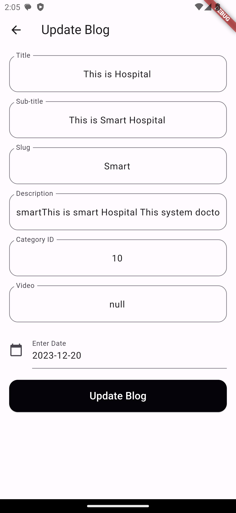
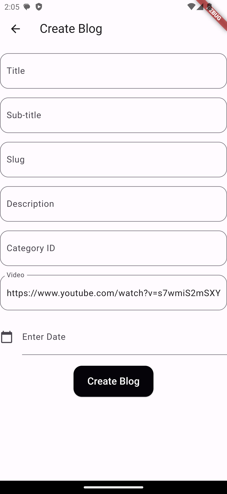

# Flutter Blog App

The **Flutter Blog App** is a mobile application that enables users to read, create, update, and delete blog posts. The app includes features such as user authentication, a blog post list, and detailed views for reading and managing blog posts. State management is handled using the Provider package.

## Screenshots

    

## Features

- **User Authentication**: Users can log in to the app to access personalized features and securely manage their blog posts.
- **Blog List**: View a list of blog posts with key information such as title, author, and date.
- **Read**: Read the full content of a blog post in a detailed view.
- **Create**: Users can create new blog posts, adding titles, content, and other relevant details.
- **Update**: Edit existing blog posts to update their content or other details.
- **Delete**: Remove unwanted blog posts from the user's collection.

## State Management

The app utilizes the Provider package for efficient state management. This ensures a seamless and reactive user experience.

## API Integration

The app communicates with a RESTful API using Postman for testing and validation. Each API request is accompanied by a token for secure validation.

## Getting Started

To run the Flutter Blog App on your local machine, follow these steps:

1. Clone this repository to your local machine.
2. Install Flutter and Dart on your system.
3. Navigate to the project directory and run `flutter pub get` to install dependencies.
4. Connect a device or use an emulator, then run `flutter run` to start the app.

## Contributing

Contributions are welcome! If you have any ideas for improvements or find any issues, please open an issue or submit a pull request.

## License

This project is licensed under the [MIT License](LICENSE).
